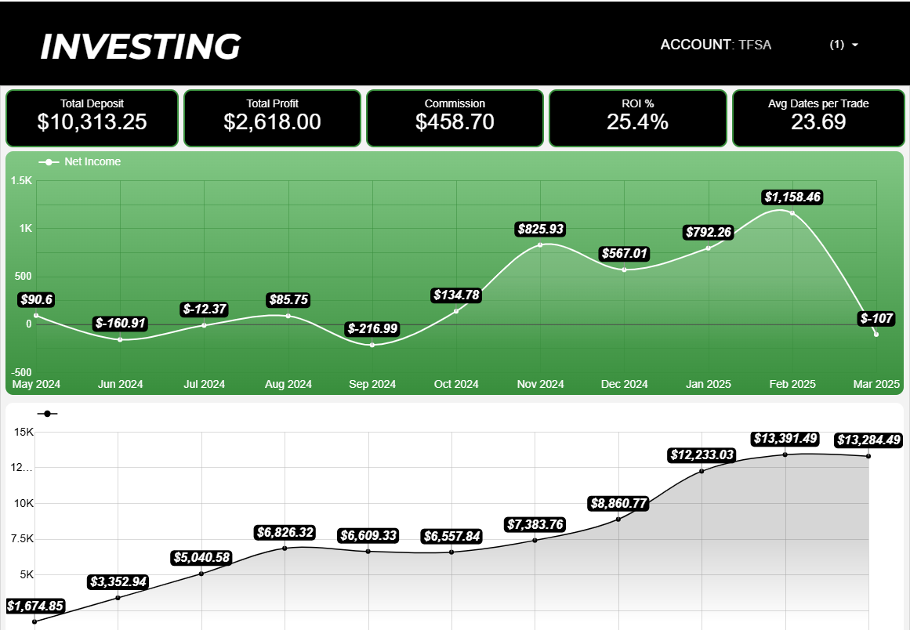

# 📊 Stock Performance Report – TFSA Account

This project is an interactive **Looker Studio dashboard** designed to track and analyze my trading performance within the TFSA account. It highlights monthly profits, commissions, ROI %, and trade duration.

## 🧰 Tools Used
- **Google Sheets** – manual and automated logging of trades
- **Google Looker Studio** – dashboard creation and data visualization
- **Apps Script** – used to enhance data preparation in Google Sheets

## 📈 Dashboard Metrics
- **Total Deposit**: $10,313.25  
- **Total Profit**: $2,618.00  
- **Commission Paid**: $458.70  
- **ROI %**: 25.4%  
- **Avg Days per Trade**: 23.69  

## 📊 Visual Insights

- Monthly performance is tracked via **net income** (top chart)
- Account growth is visualized in the **cumulative balance** (bottom chart)
- Volatility and patterns in profitability are easy to spot, helping identify strong vs. weak months

## 🖼 Dashboard Preview

## 💡 Why This Matters

This dashboard helps me:
- Identify the most/least profitable periods
- Track how long I hold positions on average
- Optimize my trading strategy based on historical trends
- Prepare my portfolio for future forecasting models

## 📬 Contact

Created by **Alex Davydenko**  
🌐 [alexinsights.com](https://alexinsights.com) | 📧 alexseobot@gmail.com
